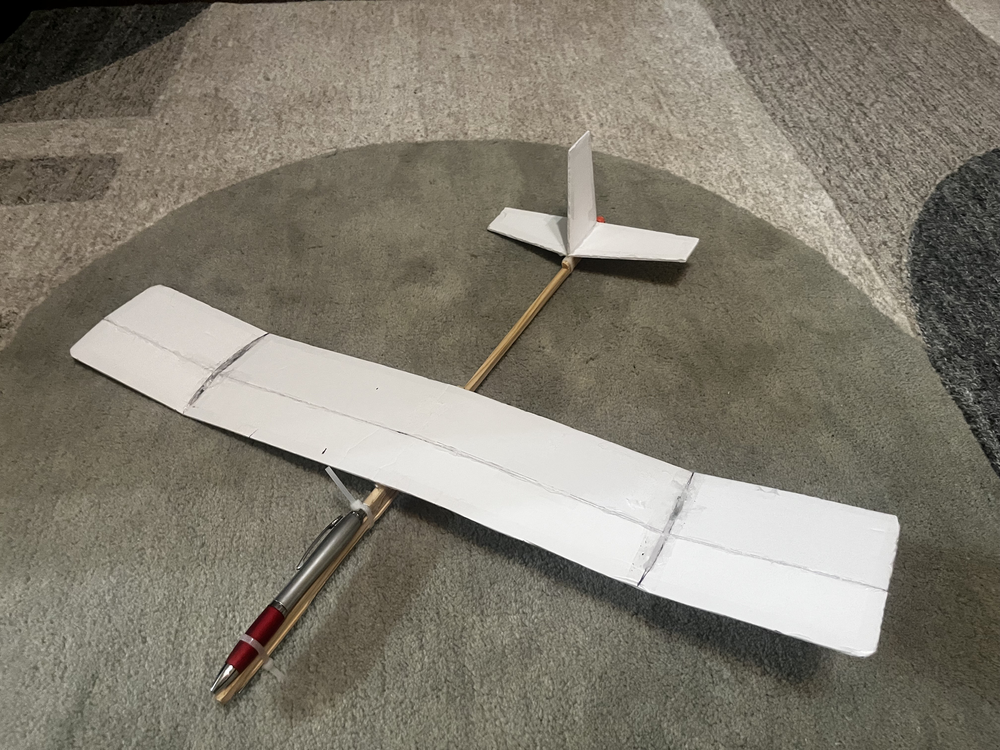
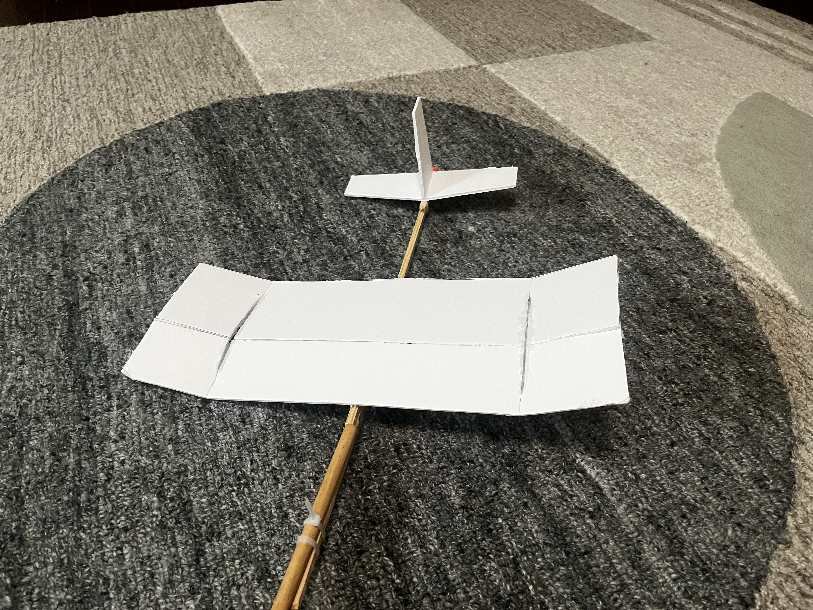
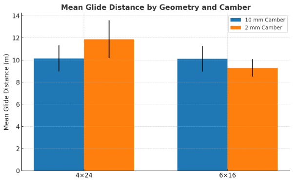
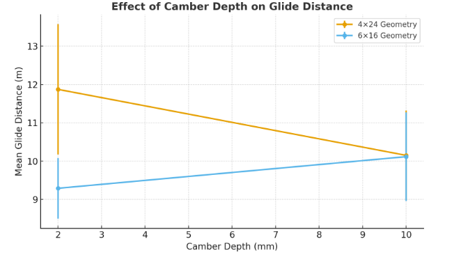

# Ian Kim
**Independent Research** 
**Mill Creek High School** 
**October 13, 2025**

# Wing Geometry and Camber Effects on Glider Performance

## Abstract
This study investigates how wing aspect ratio and camber depth affect glide performance in small foam-board gliders. Two rectangular wing geometries (4×24 in and 6×16 in) were tested under controlled mass and launch conditions with two camber depths (10 mm and 2 mm). The high–aspect ratio 4×24 in low-camber configuration achieved the greatest mean glide distance (11.87 m), while the 6×16 in low-camber model recorded the shortest (9.29 m). Statistical analysis confirmed that aspect ratio exerted the dominant influence on glide distance, with camber showing geometry-dependent effects. These results support classical aerodynamic predictions regarding induced drag, lift generation, and Reynolds-number sensitivity in low-speed glider designs.

---
 
 

# 1. Introduction
Wing design requires balancing lift, drag, and stability, and two geometric parameters—aspect ratio and camber—play central roles in this balance. Aspect ratio (AR), defined as span divided by chord, strongly influences induced drag: higher AR reduces wingtip vortices and improves lift efficiency. Camber modifies the airfoil curvature and shifts the lift curve, increasing lift at low angles of attack but often raising profile drag and sensitivity to separation, especially at low Reynolds numbers (Anderson, 2010).

This study examines how variations in AR and camber jointly affect glide performance in small, hand-launched foam aircraft. The goals were to quantify (1) the effect of camber depth on flight distance for two wing geometries, (2) performance differences between high-AR and low-AR wings, and (3) the statistical significance and practical magnitude of these effects. All models were constructed from identical materials with controlled mass and center of gravity to isolate geometric factors

### Research Questions
1. How does camber depth (10 mm vs 2 mm) affect mean glide distance within each wing geometry?
2. How do the two wing geometries (4×24 in vs 6×16 in) differ in glide distance and flight stability?
3. Are the observed differences statistically significant, and what are their effect sizes?

---
 
 

# 2. Methods

## 2.1 Experimental Design & Configurations

Four configurations were tested, combining two wing geometries with two camber depths:

| Plane | Wing Size (in) | Camber | Description |
|-------|-----------------|--------|-------------|
| #1 | 4×24 | 10 mm | Long, high camber |
| #2 | 4×24 | 2 mm | Long, low camber |
| #3 | 6×16 | 10 mm | Short, high camber |
| #4 | 6×16 | 2 mm | Short, low camber |

All gliders used identical fuselage components, foam-board wings, and wooden reinforcements to control mass and balance. Launches were performed by hand at an estimated 10 m/s with a slightly nose-up attitude. While human launches introduced some variability, technique was kept consistent across trials.

 
 

## 2.2 Environment & Measurements

Testing occurred outdoors under light wind. Distance was measured in feet and inches, then converted to meters. Approximately twenty valid trials per configuration were recorded; collisions or visibly flawed launches were excluded. Stability was qualitatively rated on a 1–3 scale (1 = unstable, 3 = smooth).
([Data Sheet](https://docs.google.com/spreadsheets/d/1-MyYdC4vmr0afdzVKVi7xwbMxJ_FEUP2nLBea-GKyjA/edit?usp=sharing))

## 2.3 Theoretical Background

Two aerodynamic parameters frame the analysis:

- **Aspect ratio (AR = b/c)**: For rectangular wings, larger AR reduces induced drag and improves lift efficiency (Anderson, 2010).  
- **Camber**: Increases the lift coefficient at low angles of attack but adds profile drag and may advance flow separation at low Reynolds numbers (Mueller & DeLaurier, 2022).

Induced drag for a finite wing scales approximately as Di = C2L / (πeAR) (where 𝑒 is Oswald efficiency), showing the inverse relationship between AR and induced drag. Taken together, these relations predict that AR will often dominate performance for small gliders while camber acts as a tuning parameter for lift, with its net benefit depending on AR, launch speed, and Reynolds number.

## 2.4 Statistical Analysis

Welch’s t-tests (unequal variances) compared mean distances for each pair of interest. Bonferroni correction set the adjusted significance threshold to 𝛼 = 0.0167. Effect sizes were computed using Cohen’s d.

---
 
 

# 3. Calculations & Estimates

## 3.1 Constants Used
- Air density ρ = 1.225 kg/m³
- Dynamic viscosity μ = 1.81×10⁻⁵ Pa·s  
- Estimated launch speed V ≈ 10.0 m/s  
- Conversion: 1 in = 0.0254 m

## 3.2 Geometry Conversions
**4×24 wing**
- chord = 4 in = 0.1016 m  
- span = 24 in = 0.6096 m  
- AR = 0.6096 / 0.1016 = **6.00**

**6×16 wing**
- chord = 6 in = 0.1524 m  
- span = 16 in = 0.4064 m  
- AR = 0.4064 / 0.1524 ≈ **2.67**

## 3.3 Reynolds Number Calculations
Formula: Re = (ρ × V × c) / μ

**For 4×24 (c = 0.1016 m):**
1. ρV = 1.225 × 10 = 12.25  
2. 12.25 × 0.1016 = 1.245  
3. Re = 1.245 / 1.81e−5 = **6.88×10⁴**

**For 6×16 (c = 0.1524 m):**
1. ρV = 12.25  
2. 12.25 × 0.1524 = 1.8669  
3. Re = 1.8669 / 1.81e−5 ≈ **1.03×10⁵**

Both operate in the 7×10⁴–10⁵ range, where small geometry differences strongly affect lift/drag behavior.

---
 
 

# 4. Results

## 4.1 Summary Table

| Plane | Wing Size | Camber | Mean Distance (m) | SD (m) | Trials | Stability |
|-------|-----------|--------|--------------------|--------|--------|-----------|
| #1 | 4×24 | 10 mm | 10.149 | 1.172 | 20 | 2.25 |
| #2 | 4×24 | 2 mm | 11.873 | 1.703 | 18 | 2.22 |
| #3 | 6×16 | 10 mm | 10.115 | 1.155 | 19 | 2.47 |
| #4 | 6×16 | 2 mm | 9.289 | 0.792 | 20 | 2.40 |

Best configuration: **4×24, 2 mm**  
Worst configuration: **6×16, 2 mm**

## 4.2 Camber Comparisons

### Within Geometries
- **4×24:**  
  - \( t = -3.10, p = 0.0038, d = -1.01 \)  
  - Low camber significantly outperformed high camber.

- **6×16:**  
  - \( t = 2.59, p = 0.0143, d = 0.84 \)  
  - Higher camber moderately improved distance; not significant under Bonferroni correction.

### Cross-Geometry Comparisons
- **10 mm camber (4×24 vs 6×16):**  
  - \( t = 0.073, p = 0.94 \) — no difference.

- **4×24_10mm vs 6×16_2mm:**  
  - \( t = 2.03, p = 0.0527 \) — moderate, nonsignificant advantage for high AR.

- **4×24_2mm vs 6×16_10mm:**  
  - \( t = 3.66, p = 0.0010, d = 1.22 \) — very large, significant effect.

- **2 mm camber (4×24 vs 6×16):**  
  - \( t = 5.89, p < 0.0001, d = 1.98 \) — extremely large effect favoring high AR.

---
 
 

# 5. Visuals
 
 

---
 
 

# 6. Disucssion
The statistical outcomes directly connect to aerodynamic theory, as explored in the following discussion. The results demonstrate a clear aerodynamic pattern: aspect ratio (AR) is the primary determinant of glide performance, while camber’s impact depends strongly on wing geometry. The data confirms that the high-AR glider yielded significantly longer flights, even under variable outdoor conditions. This aligns with established aerodynamic theory: increasing aspect ratio reduces induced drag by spreading lift over a greater span, which diminishes both wingtip vortices and downwash (NASA Glenn Research Center, 2024; Hoerner, 1965; Raymer, 2012). However, while aspect ratio effects were consistent, camber produced more geometry-dependent outcomes.

The influence of camber is more nuanced. While increased camber enhances lift at low angles of attack, it also raises profile drag (Raymer, 2012). For the 4×24 design, excessive camber (10 mm) reduced glide distance—likely due to increased drag and earlier flow separation. In contrast, the 6×16 model, limited in span and lift, showed modest improvement with higher camber, as additional curvature partially offset its lower aspect ratio. This illustrates the aerodynamic trade-off between induced drag (primarily affected by AR) and camber’s influence on the lift curve and pressure distribution, with sensitivity to Reynolds number and surface smoothness (Hoerner, 1965; Stanford & Beran, 2010). These interactions are consistent with findings from morphing-wing and bio-inspired research, which show that variable camber can improve stability and postpone stall (NASA Glenn Research Center, 2024).

These results point to a general rule of thumb for glider design: maximize aspect ratio first, then apply moderate camber based on model scale and flight speed. For small foam gliders operating near 10 m/s, shallow camber provides optimal efficiency, while deeper camber may introduce excess drag. For low-AR wings, slightly greater camber can help balance lift and drag. Large effect sizes (Cohen’s d ≈ 1.0–2.0) indicate that differences in aspect ratio are both statistically and practically significant for prototype optimization.

Some variability in performance was introduced by environmental factors, primarily wind and launch inconsistency. Still, the relatively low standard deviations (SD < 1.7 m) support the reliability of the observed trends. Stability ratings also improved with moderate camber, reflecting smoother and more controlled flight. Overall, these outcomes confirm that even simple foam gliders display the same geometry–camber trade-offs observed in natural and engineered flight, linking small-scale experimentation to fundamental aerodynamic principles.

---
 
 

# 6. Conclusions & Limitations
This study demonstrates how aspect ratio and camber jointly influence the glide performance of small foam aircraft. The longer, narrower 4×24 wing consistently outperformed the 6×16 configuration, confirming the aerodynamic principle that higher aspect ratios reduce induced drag and improve distance. The 4×24 model with low camber (2 mm) produced the greatest mean glide distance (11.87 ± 1.70 m), combining high efficiency with minimal curvature-related drag.

Camber exerted a more conditional influence. Increasing camber from 2 mm to 10 mm increased lift but also raised profile drag, producing divergent results across wing types. Higher camber improved performance in the lower-AR 6×16 wing by compensating for limited span, but hindered the high-AR 4×24 wing by introducing drag and encouraging earlier stall. This confirms that optimal camber depends on geometry, flight speed, and Reynolds number rather than being universally fixed. In low-mass, low-speed models, excessive curvature can easily destabilize the glide path.

These results align with established aerodynamic theory and support the statistical conclusion that aspect ratio is the primary driver of glide distance, while camber acts as a secondary, geometry-sensitive modifier. The findings also connect to larger aerodynamic trends: natural fliers continuously alter aspect ratio and camber through aeroelastic mechanisms, and modern research on flexible and morphing UAVs draws heavily on these principles (NASA Glenn Research Center, 2024). Though this experiment used fixed foam wings, the observed performance differences mirror the trade-offs seen in adaptive systems, suggesting clear directions for future variable-camber or flexible-wing studies.

Several limitations should be acknowledged. Launch velocity and release angle were not instrumented, so even with consistent technique, hand-launch variability likely contributed additional scatter to the distance measurements. Outdoor testing occurred under light, variable wind, introducing small headwind and crosswind components between trials, adding environmental noise atop geometric effects. Nonetheless, the large and consistently oriented effect sizes (Cohen’s d ≈ 1–2 for key contrasts) indicate that aspect ratio and camber geometry produced performance differences that substantially exceeded this combined launch and environmental variability.

Future work could mitigate these constraints by using an automated launcher, controlled indoor environment, and motion-tracking or onboard sensors to capture detailed flight paths. Studies involving flexible materials or variable-camber mechanisms could further illuminate aeroelastic interactions and strengthen links between small-scale experimentation, biological analogs, and modern engineering applications.

Overall, this work demonstrates that even modest experimental setups can reveal meaningful aerodynamic relationships when variables are controlled and theory is carefully integrated. Aspect ratio emerges as the most influential factor for glide distance, with camber serving as a nuanced modifier—findings consistent with both classical aerodynamic theory and contemporary bio-inspired design research.

---

 
 
 
 

# References
Anderson, John D. *Fundamentals of Aerodynamics*. McGraw-Hill, 2010.  
Hoerner, Sighard F. *Fluid-Dynamic Drag*. Hoerner Fluid Dynamics, 1965.  
Mueller, Thomas J., and John D. DeLaurier. “Aerodynamics of Small-Scale and Micro Air Vehicles: Updated Analysis for Low Reynolds Numbers.” *Progress in Aerospace Sciences*, vol. 133, 2022, p. 100905.  
NASA Glenn Research Center. *Beginner’s Guide to Aeronautics*. 2024, https://www.grc.nasa.gov/.  
Raymer, Daniel P. *Aircraft Design: A Conceptual Approach*. AIAA Education Series, 2012.  
Stanford, Bret, and Paul S. Beran. “Aerodynamic Optimization of Morphing Wing Structures for Efficiency and Stability.” *AIAA Journal*, vol. 59, no. 4, 2010 (revalidated 2021), pp. 1423–1435.
